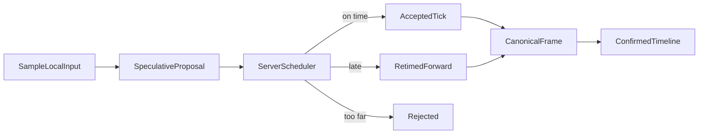

# Rollback and input

UNDPWR uses one authoritative server timeline. Clients speculate ahead for responsiveness, but
only server-finalized input frames become confirmed state.

## Input states

Each buffered input has one local provenance:

- `Predicted`: no command is known, so the preceding command is held.
- `Speculative`: the local client has proposed this command for a future server tick.
- `Authoritative`: the server finalized this command for this tick.

Provenance is not serialized or hashed. Gameplay sees the same fixed `SimInput` payload
regardless of how the buffer obtained it.

## Scheduling an input

`SimClientSession.SubmitLocalInput` estimates the current server tick and requests:

```text
estimated server tick + adaptive input lead
```

The lead starts at 3 ticks at 60 Hz. RTT, jitter and recent retiming raise it quickly; a stable
connection lowers it slowly, never below one tick. There is no zero-delay networking mode.

The server applies one rule: finalized history is immutable. A proposal for a tick already
simulated is moved to the earliest unsimulated tick. A proposal beyond the configured future
horizon is rejected. Every decision carries the proposal sequence, requested tick and assigned
tick so the client can reconcile the exact speculative command.



## Prediction and rollback

Missing commands hold the player's preceding command. Steady movement therefore predicts
correctly. A correction only dirties the first tick whose simulation-affecting command changed.

When the server accepts a local proposal at its requested tick, its provenance changes from
speculative to authoritative without replay. A retimed or rejected proposal clears the old
speculative slot; if that slot was already simulated, replay starts there.

`ISimStepHandler` remains pure:

```csharp
public void OnBeforeStep(
    DeterministicWorld world, int tick, SimInputFrame inputs, bool isReplay)
{
    for (int slot = 0; slot < inputs.PlayerCount; ++slot)
    {
        SimInput input = inputs[slot];
        // Apply deterministic gameplay from input.
    }
}
```

Never read `Time.deltaTime`, live input, transforms, or random state here. Use `isReplay` only
to suppress presentation effects, never to branch simulation.

## Bounded work per Unity frame

`RollbackEngine.Advance` separates `TargetTick` from `CurrentTick`:

- `TargetTick` follows wall-clock fixed updates.
- `CurrentTick` is the newest coherently simulated tick.
- `CatchUpBacklog` is the remaining distance.

Each call performs at most `SimNetConfig.MaxSimulationStepsPerFrame` complete simulation ticks,
including confirmed drain, replay and forward catch-up. The default is 8. Work stops only at a
tick boundary, and `_pendingReplayFrom` persists until the correction reaches `TargetTick`.

Useful properties:

```csharp
engine.IsCatchingUp;
engine.CatchUpBacklog;
engine.BudgetExhausted;
engine.LastSimulationSteps;
engine.LastReplayLength;
```

## Hard resync

Local rollback stops being useful when:

- the required predecessor snapshot has left history;
- confirmation is at least `HardResyncTicks` behind the target; or
- a late input/event correction is older than retained history.

The engine raises `HardResyncRequired`. `SimClientSession` requests a reliable server rebuild,
pauses advancement, recreates the native world, restores all three state channels, clears stale
speculation and resumes at the server snapshot tick.

The default soft warning is 12 ticks and hard resync is 30 ticks (500 ms at 60 Hz).

## Immediate input feedback

Do not reduce scheduling lead to make controls feel instant. Subscribe to
`InputAnticipated`/`EventAnticipated` and drive camera motion, animation intent, UI and cosmetic
effects immediately. Resolve those effects through `InputResolved`/`EventResolved` when the
server accepts, retimes or rejects the proposal. Presentation must never feed transforms back
into deterministic simulation.
