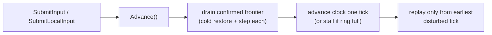

# Rollback and input

This chapter covers the engine at the level you drive it: the step handler where your
simulation lives, how a tick advances, and — the part most worth getting right — how to submit
input without stalling the session.

## The step handler

Everything a game does to the simulation goes through
[`ISimStepHandler`](../Rollback/RollbackEngine.cs). A rollback replays ticks, so anything
applied outside this callback happens on the original pass and *not* on the replay, which
desyncs a peer against itself.

```csharp
public sealed class MyGameplay : ISimStepHandler
{
    public void OnBeforeStep(DeterministicWorld world, int tick, SimInputFrame inputs, bool isReplay)
    {
        // Apply forces, steering, spawns — everything that drives the step.
        for (int slot = 0; slot < inputs.PlayerCount; ++slot)
        {
            SimInput input = inputs[slot];
            // ... resolve the entity this slot drives and push a force ...
        }
    }

    public void OnAfterStep(DeterministicWorld world, int tick, bool isReplay) { }
}

engine.AddHandler(new MyGameplay());
```

Rules the handler must follow:

- **Be a pure function of world state and inputs.** No `Time.deltaTime`, no
  `UnityEngine.Random`, no reading live input — only `inputs`.
- **Iterate `inputs` in slot order.** Slots are assigned in ascending player-ID order at
  session start and are stable across peers. Two peers applying the same forces in a different
  order get different floating-point results.
- **Use `isReplay` only to suppress presentation**, never to change the simulation. It is true
  when the tick is being resimulated after a rollback; gate one-shot sounds or particles on it
  so they do not fire several times per tick.
- **Register handlers from one place at session start.** Handler order is part of the
  simulation; do not add handlers from each object's own initialisation.

If you use the gameplay layer, `SimGameHost` is the single step handler and you never write one
directly — see [The gameplay layer](Gameplay.md).

## Input: the fixed struct

[`SimInput`](../Rollback/SimInput.cs) is one player's input for one tick: a `Buttons` bit field
and four analogue axes, plus the `PlayerId` and `Tick` it applies to. It is a fixed-size struct
on purpose — a per-tick allocation in a loop that replays every frame is the easiest way to
make a rollback engine stutter, and a fixed payload serialises trivially.

```csharp
SimInput input = SimInput.Neutral(playerId, tick);
input.Buttons = buttonBits;
input.AxisX = moveX;
input.AxisY = moveZ;
```

`SimInputFrame` is every player's input for one tick, indexed by slot. For camera-relative
movement, build inputs with `SimInputEncoder` rather than by hand — it quantizes and
dequantizes locally so the sender simulates the exact value the receivers will. See
[The gameplay layer](Gameplay.md#players-and-camera-relative-input).

## The tick lifecycle

Each `engine.Advance()`, once per `FixedUpdate`:

1. **Confirm.** Drain whatever the confirmed frontier reached into the confirmed timeline, one
   cold restore-and-step per tick, capturing each snapshot.
2. **Advance the clock** one tick of wall time — unless doing so would lead further than the
   ring can retain, in which case the peer stalls.
3. **Replay** the prediction window, but only from the earliest tick a misprediction or a new
   confirmation disturbed.

The lead over the confirmed tick is emergent — `engine.CurrentLead` — growing when
confirmations lag and shrinking as they arrive. `Advance()` returns `false` when the peer is
stalled (`engine.IsStalled`) waiting for inputs.



## Submitting input without stalling

This is the part to get right. Confirmation needs an **unbroken run** of ticks from every
player: the confirmed frontier walks forward only over ticks every player has filled and stops
at the first gap. One missing tick is not untidy — it is terminal. The frontier never gets past
it, and the peer stalls for good once the clock reaches its bound, with input appearing to do
nothing.

`engine.LocalInputTick` is the tick a sample taken *now* should be stamped for. It is
`CurrentTick + LocalInputDelay`, so it starts ahead of the clock — which means stamping a
single tick per frame leaves the `LocalInputDelay` ticks between session start and the first
stamp uncovered forever.

**Submit a run, every frame, from the tick after the last one you submitted through
`LocalInputTick`:**

```csharp
// Driving the engine directly:
for (; nextLocalTick <= engine.LocalInputTick; ++nextLocalTick)
{
    engine.SubmitInput(SampleLocalInput(nextLocalTick));
}
engine.Advance();
```

Start `nextLocalTick` at `engine.CurrentTick` for a fresh session, and at the resume tick after
every `PrepareForRebuild`.

**With a session, let it fill the run for you** — this is the recommended path:

```csharp
session.SubmitLocalInput(SampleInput()); // stamps for LocalInputTick and fills every tick behind it
```

`SimSession.SubmitLocalInput` fills the whole run and copies the current sample across the gap,
which is also the correct value: repeating the newest input is exactly what the other peers'
prediction assumed for those ticks, so filling them agrees with the guess instead of forcing a
correction.

## Prediction and mispredictions

Remote inputs the engine has not received yet are predicted by repeating each player's last
input. When the real input arrives and differs (`SimInput.SameCommandAs` is the test), the
engine records how far back it must replay and does so on the next `Advance`. A player holding
a steady input produces predictions that match exactly and cost nothing; only a *change* in
input triggers a rollback, and only back to the tick it changed on.

## Stalling

`engine.IsStalled` becomes true when the lead would outrun `SnapshotHistory`. This is intended:
leading further would overwrite a tick a late input still needs, so the peer pauses visibly
instead of losing the window silently. It resolves itself as soon as confirmation catches up.
Constant stalling means `SnapshotHistory` is too small for the latency, or a peer cannot hold
the tick rate — see [Troubleshooting](Troubleshooting.md).
